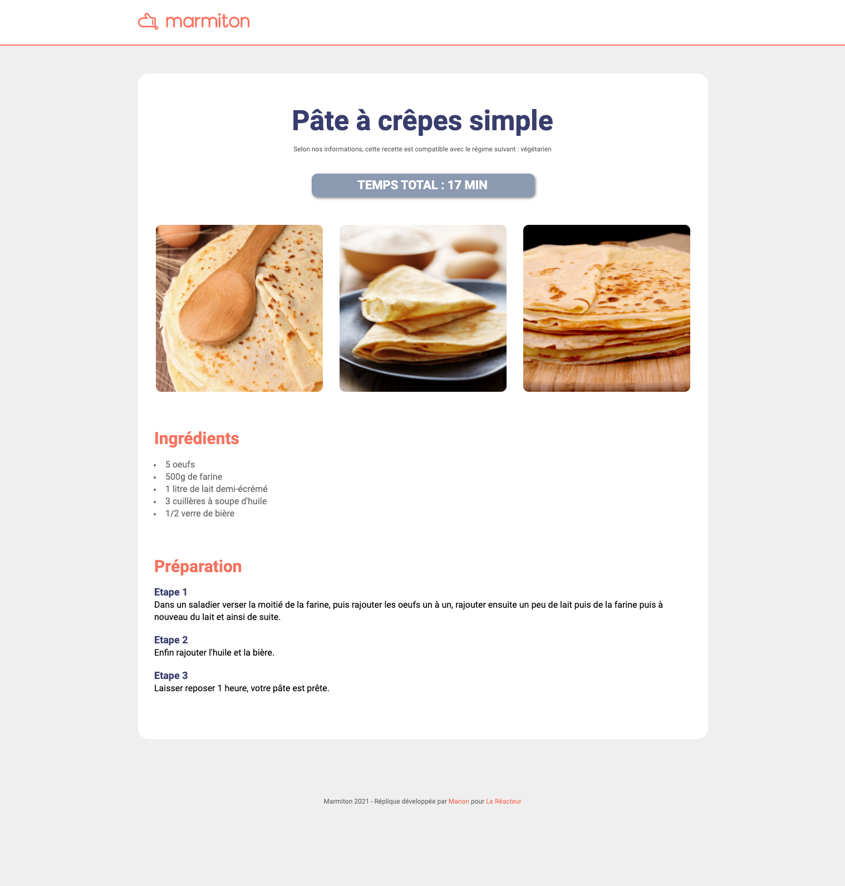

# MARMITON CLONE 🥞🧇

⛅️ April 2021  
✨ Frontend

## 🌈 Overview - Welcome dude

---

Copy of Marmiton's recipe page made at [Le Reacteur](https://www.lereacteur.io/) Bootcamp.  
1 web page is available: recipe page.

## 👩🏻‍💻 Tasks

---

✘ Integration web: simple CSS (no flexbox or grid)

## 📚 Stacks

---

[HTML5](https://www.w3schools.com/html/default.asp)  
[CSS3](https://www.w3schools.com/css/default.asp)

🙏🏻 Thank you @LeReacteur.
